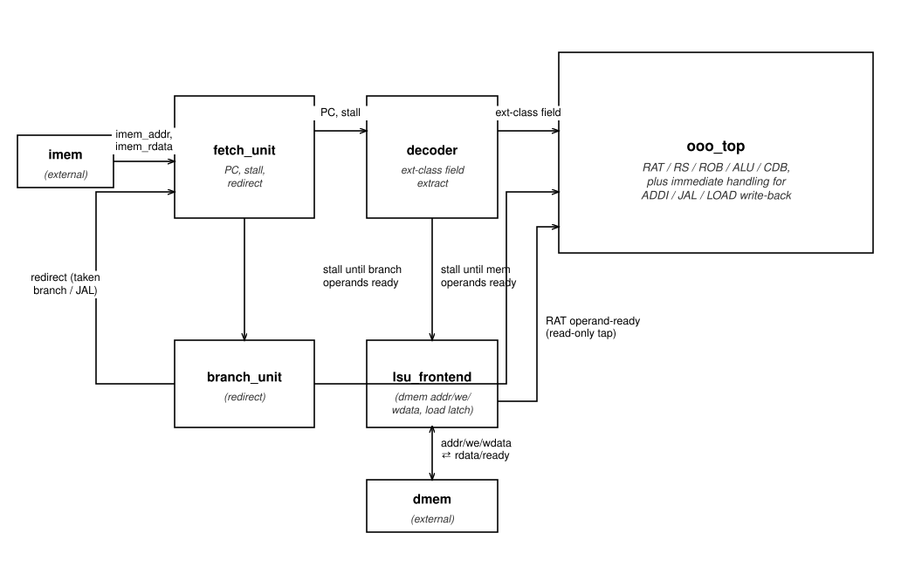
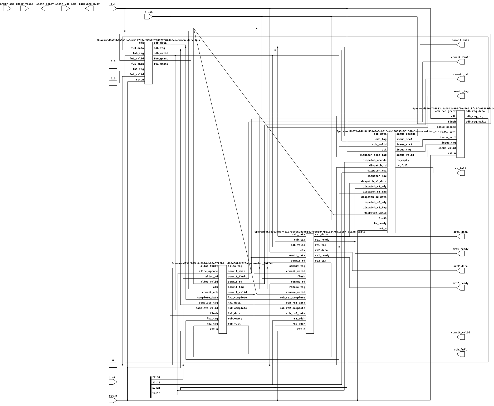
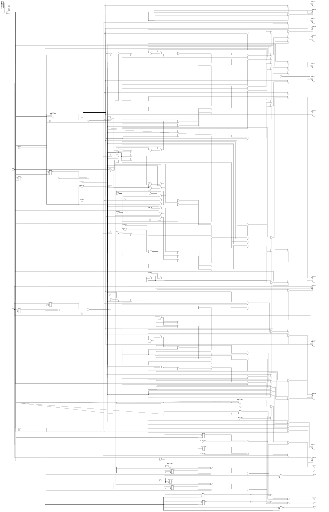
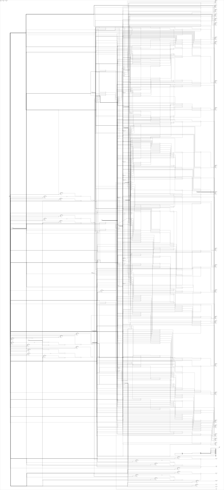
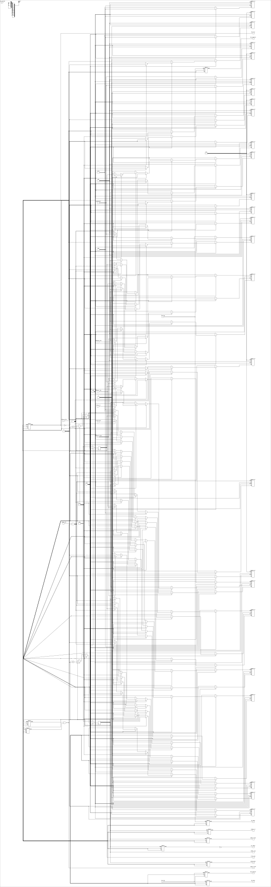
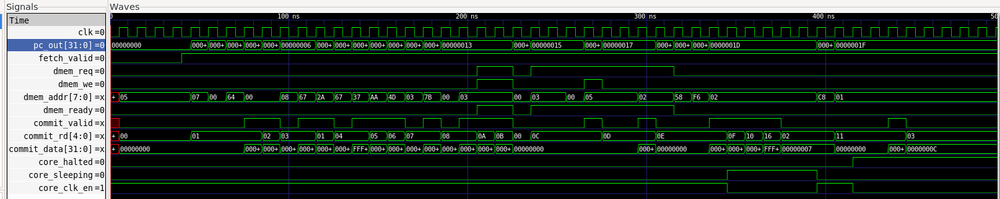

# RISC-V OoO CORE

A small out-of-order RISC-V-style processor core: in-order fetch and
decode feeding a Tomasulo-style out-of-order execution backend (register
alias table, reservation station, reorder buffer, a single ALU, and a
common data bus), with branch and load/store resolution handled in the
front end. Six instruction classes are wired and verified end to end:
ALU/ADDI, JAL, LOAD, STORE, BRANCH (BEQ/BNE/BLT), and SYSTEM (HALT/WFI),
plus reserved-encoding fault detection.

## Tech stack

| Layer | Tool |
|---|---|
| HDL | Verilog (IEEE 1364-2005) |
| Simulation | AMD XILLINX Vivado (`iverilog` / `vvp`) |
| Waveform viewing | Xillinx Vivado |
| Synthesis / netlist extraction | Yosys (`write_json`) |
| Circuit diagrams | [netlistsvg](https://github.com/nturley/netlistsvg) (gate-level), hand-drawn SVG (architecture-level), AMD Xilinx Vivado schematic viewer (top-level, post-synthesis) |

## Background

Out-of-order execution exists to solve one problem: a strictly in-order
pipeline stalls the moment one instruction is waiting on something (a
cache miss, a long-latency divide, a not-yet-ready operand), even if
instructions behind it in program order have everything they need to
run right now. The fix, in essence, is to let instructions leave program
order for execution and rejoin it for their externally visible effects.

The specific mechanism this core implements — a scoreboard of "reservation
stations" that wait for operands to become available, a broadcast bus
that forwards a just-computed result to every station waiting on it in
the same cycle, and register renaming so that a new write to a register
doesn't stall until an old read of the same name has issued — was
introduced by IBM to build the floating-point unit of the System/360
Model 91 and remains the conceptual basis for how nearly every modern
out-of-order CPU issues instructions [1]. The second piece this core
needs — a way to make a machine that finishes instructions out of order
still *look*, from the outside, like it executed them one at a time, so
that an exception or an interrupt has one unambiguous point to occur at
— is the reorder buffer, a mechanism proposed a couple of decades later
specifically to give pipelined and out-of-order machines precise
interrupts without giving up the performance out-of-order completion
provides [2]. This core's ROB commits results strictly in program order
even though the ALU and the reservation station can finish them in any
order.

The instruction encoding is a small custom format documented in
`docs/isa_spec.md`, loosely RISC-V-flavored rather than a compliant
implementation of the standard — the RISC-V base ISA itself [3] is the
reference point for the register file shape (32 general-purpose
registers), the instruction classes chosen, and the overall load/store,
branch, and system-call philosophy.

## Architecture

**Dataflow** — how fetch, decode, the front-end resolvers, and the
out-of-order backend connect (drawn to match how the gate-level diagrams
below are read, not auto-generated from the netlist):



Instruction and data memory both live outside `riscv_ooo_top`: the core
exposes word-addressed `imem_addr`/`imem_rdata` and a request/ready
handshake on the data side (`dmem_addr`/`dmem_req`/`dmem_we`/
`dmem_wdata`/`dmem_rdata`/`dmem_ready`) rather than assuming a same-cycle
memory, specifically so a real bus adapter can sit underneath it without
the core needing to change (see `core_axi_adapter`).

Branches and stores are deliberately resolved in the front end rather
than dispatched into the out-of-order backend: `branch_unit` and
`lsu_frontend` read a dedicated, read-only tap into the RAT's operand-
readiness signals, stall fetch until the operands they need are ready,
then act directly — redirect the PC, or drive a memory write. Because
fetch never advances past an unresolved branch or store, there is
nothing speculative in flight to unwind, and the backend's own flush
path is never exercised by this design. The trade-off is real: no
memory-level or branch-level parallelism, every branch and store is a
full pipeline stall. What it buys back is that the Tomasulo machinery
underneath — the part with the actual hazard-timing subtlety — never has
to be touched to add front-end features on top of it.

**Top-level architecture** — `riscv_ooo_top` in AMD Xilinx Vivado's
post-synthesis schematic viewer, every instantiated sub-module shown
exactly as Vivado placed and wired it, not hand-drawn:


Full-resolution schematic: [`docs/schematic.pdf`](docs/schematic.pdf).

The same schematic with those sub-modules expanded down to the
primitive FPGA cells underneath them — LUTs, `FDCE` flip-flops, and
`CARRY4` arithmetic chains — exactly as synthesis placed every gate:


Full-resolution schematic: [`docs/images/schematic_expanded.pdf`](docs/Schematic_Expanded.pdf).

**The out-of-order backend itself** (`ooo_top`) — register alias table,
reservation station, reorder buffer, ALU, and common data bus as five
sub-blocks, generated directly from the RTL (`yosys` +
[netlistsvg](https://github.com/nturley/netlistsvg), not hand-drawn):



## The Tomasulo mechanism, concretely

Three structures do the actual out-of-order work, and each is shown
below at a reduced, single-entry size purely so the per-entry logic is
legible — the production core instantiates 8 reservation-station entries
and a 16-entry reorder buffer; the wiring between entries and the shared
buses is identical at any depth, just repeated.

**Register alias table** — maps each of the 32 architectural registers to
either "ready, here is the value" or "not ready yet, here is the ROB tag
that will produce it." Every dispatched instruction reads this table for
its source operands and writes a new tag for its own destination, which
is what lets a later instruction stop waiting on a *register name* and
start waiting on a *specific result* instead:



**Reservation station** — one entry per instruction in flight before it
executes. An entry holds an opcode, two operand slots (each either a
value or a tag to wait for), and a valid bit; every cycle, each entry
compares its waiting tag(s) against whatever tag is currently being
broadcast on the common data bus, and captures the value the instant a
match occurs. An entry is eligible to issue once both its operands have
resolved to values:



**Reorder buffer** — a circular queue of in-flight instructions in
program order. An instruction allocates a ROB entry at dispatch (this is
the tag the RAT and reservation station wait on) and writes its result
into that entry when the ALU finishes, but the result is only committed
to the architectural register file — made externally visible — when the
entry reaches the head of the queue. This is the precise-interrupt
mechanism: an exception or fault only ever has to unwind instructions
that haven't reached the head yet, never ones that already committed:



Per-module diagrams for the remaining blocks (generated the same way,
each small enough to show whole): [fetch_unit](docs/images/fetch_unit.svg) ·
[decoder](docs/images/decoder.svg) ·
[branch_unit](docs/images/branch_unit.svg) ·
[lsu_frontend](docs/images/lsu_frontend.svg) ·
[integer_alu](docs/images/integer_alu.svg) ·
[common_data_bus](docs/images/common_data_bus.svg).

## A load's two-cycle split, and why

A load's destination register still goes through the normal dispatch
path (so it gets the RAT/ROB's ordering and hazard handling for free),
which means the instruction word being dispatched needs its `rs1` field
forced to `x0` so the ALU computes `0 + loaded_value`. But that same
input port is also what resolves, on the cycle the load is *issued*, the
real base register used to compute the memory address — the same field
cannot mean both things on the same cycle. The split: cycle 1 resolves
the address and latches the memory response; cycle 2 dispatches the
latched value as a rewritten `ADD rd, x0, imm=<loaded value>`. ADDI and
JAL do not need this — only a load's value is unknown until a memory
response actually arrives.

## What's verified

`tb/tb_riscv_ooo_top.v` checks 18 committed instructions against the
actual dynamic execution order (accounting for branches and jumps
skipping instructions, not just static program order), including:
dmem contents checked directly, not just via load-back; a dedicated
"poison" destination register that must never be committed, proving
every redirect landed on exactly the intended instruction; ALU
read-after-write hazards chained through the CDB/ROB tag-lookup path; a
negative ADDI immediate exercising sign extension; BEQ taken, BNE
not-taken, and BLT taken with a negative operand; stores and loads at
zero and non-zero offsets; JAL's link value and redirect target; WFI
sleep-then-resume on an external wake signal; and HALT stopping fetch
permanently.

`tb/tb_riscv_ooo_top_fault.v` runs two instances, each fed a program
that trips a structurally different illegal-encoding path — both latch
a fault flag, commit nothing from the offending word, and correctly
report the core as faulted rather than halted.

Two real bugs surfaced during this process rather than being designed
around in advance. One was a testbench-only race — deasserting reset and
wake signals via a blocking assignment immediately after the clock edge
races the design's own same-edge logic, fixed by moving both to
negedge-based timing. The other was in the RTL: the reserved ALU opcode
(`3'b110`) was excluded from the fault-detection check but *not* from
the dispatch-gating check, so a reserved instruction could silently
dispatch and commit a bogus zero result on every cycle fetch stalled on
it, even while `core_faulted` was correctly asserted elsewhere. It never
showed up in the main functional test (which never fetches a reserved
opcode); a dedicated fault-path test found it directly. Fixed by
excluding the reserved opcode from the dispatch-gating signal as well.

## What's out of scope

Backward branches and loops are not exercised by the testbench (the
sign-extension and redirect-target arithmetic are the same code path
already verified for forward branches and negative immediates, but a
dedicated loop test is a reasonable addition). Loads and stores are
front-end-resolved rather than a true second out-of-order-issued
functional unit — the common data bus reserves a second port for exactly
that extension. There is no branch predictor; every branch is a full
stall, so there is nothing to mis-predict. There is no trap/CSR
architecture — an illegal instruction is a terminal fault, not a
vectored, resumable trap. And there is no assembler: test programs are
hand-encoded in the testbenches via Verilog functions that mirror the
ISA spec exactly.

## Running the simulation

Icarus Verilog (`iverilog`/`vvp`):

```bash
iverilog -g2005 -o sim/tb_main.vvp -I rtl \
    rtl/fetch_unit.v rtl/decoder.v rtl/branch_unit.v rtl/lsu_frontend.v \
    rtl/register_alias_table.v rtl/reservation_station.v rtl/reorder_buffer.v \
    rtl/integer_alu.v rtl/common_data_bus.v rtl/ooo_top.v rtl/riscv_ooo_top.v \
    tb/tb_riscv_ooo_top.v
vvp sim/tb_main.vvp
# TB_RISCV_OOO_TOP: PASS (18/18 commits verified, dmem verified, core_halted=1, 0 errors)

iverilog -g2005 -o sim/tb_fault.vvp -I rtl \
    rtl/fetch_unit.v rtl/decoder.v rtl/branch_unit.v rtl/lsu_frontend.v \
    rtl/register_alias_table.v rtl/reservation_station.v rtl/reorder_buffer.v \
    rtl/integer_alu.v rtl/common_data_bus.v rtl/ooo_top.v rtl/riscv_ooo_top.v \
    tb/tb_riscv_ooo_top_fault.v
vvp sim/tb_fault.vvp
# TB_RISCV_OOO_TOP_FAULT: PASS (both fault paths correctly latched core_faulted, 0 errors)
```

### Proof of execution

Waveform captured from `tb/tb_riscv_ooo_top.v`'s run in GTKWave —
`pc_out`, the `dmem` request/ready handshake, and `commit_valid`/
`commit_rd`/`commit_data` advancing across the 18 verified commits:



Full-resolution waveform: [`docs/images/GTKwave_output.pdf`](docs/images/GTKwave_output.pdf).

Most circuit diagrams above were regenerated from the RTL with Yosys
(`write_json`) piped into netlistsvg — commands for every diagram in this
repository, including the reduced-size ones, are in
`docs/NETLIST_DIAGRAMS.md` if you need to regenerate them after an RTL
change. The two top-level schematics are captured directly from
Vivado's post-synthesis schematic viewer instead, since that's the
tool actually placing and wiring the design at that level.

## Power

No internal clock or power gating — a CAM-searched reservation station
and a broadcast common data bus are inherently power-hungry structures,
and deliberately left unoptimized internally given this core's small
scale. `core_clk_en` is exposed as a coarse, advisory, whole-core
clock-enable (low while halted, faulted, or asleep) for an external
power controller to act on; the core itself makes no gating decisions.

## References

1. R. M. Tomasulo, "An Efficient Algorithm for Exploiting Multiple
   Arithmetic Units," *IBM Journal of Research and Development*, vol. 11,
   no. 1, pp. 25–33, 1967.
2. J. E. Smith and A. R. Pleszkun, "Implementing Precise Interrupts in
   Pipelined Processors," *IEEE Transactions on Computers*, vol. 37,
   no. 5, pp. 562–573, 1988.
3. A. Waterman, Y. Lee, D. A. Patterson, and K. Asanović, "The RISC-V
   Instruction Set Manual, Volume I: Unprivileged ISA," UC Berkeley,
   Tech. Rep. UCB/EECS-2011-62, 2011 (revised editions maintained by
   RISC-V International).
